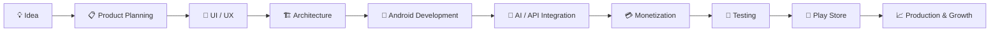

# 👋 Hi, I'm Irfanhaider Momin

<div align="center">


<br/>

**Senior Android Engineer & Mobile Architect · 8+ Years Experience**

Building scalable Android products, AI-powered mobile experiences, and production-ready applications.

<br/>

<a href="https://www.linkedin.com/in/irfanhaider-momin-07b93675">

</a>
<a href="https://github.com/Irfan121">

</a>

</div>

---

## 👨‍💻 About Me

I'm a **Senior Android Engineer, Mobile Architect, and Founder at iSmart Solutions** with 8+ years of hands-on experience designing, developing, launching, and maintaining production Android applications.

My work sits at the intersection of **mobile engineering, AI, product development, and monetization**.

I enjoy solving complex engineering problems and turning ideas into products that are fast, maintainable, scalable, and ready for real-world users.

```text
8+ Years        Android Engineering
Production      Mobile Applications
AI              Image / Video / Computer Vision
Architecture    Clean Architecture / MVVM / MVI
Product         Idea → Development → Launch → Growth
```

---

## ⚡ Core Expertise

<div align="center">

### 📱 Android Engineering


### 🤖 AI & Computer Vision


### ☁️ Backend & Development


</div>

---

## 🛠️ Technology Stack

| Area             | Technologies                                                    |
| ---------------- | --------------------------------------------------------------- |
| **Languages**    | Kotlin · Java                                                   |
| **Android**      | Android SDK · XML · Material Design           |
| **Architecture** | Clean Architecture · MVVM · MVI · SOLID · Repository Pattern    |
| **Jetpack**      | ViewModel · Navigation · Room · WorkManager · Coroutines · Flow |
| **Backend**      | Firebase · REST APIs · Realtime Database · Firebase Storage     |
| **AI / ML**      | TensorFlow Lite · OpenCV · ML Kit · Generative AI APIs          |
| **Media**        | Image Processing · Video Processing · FFmpeg · ExoPlayer        |
| **Payments**     | Razorpay · Google Play Billing · In-App Purchases               |
| **Monetization** | AdMob · Unity Ads · Ad Mediation                                |
| **Tools**        | Android Studio · Git · GitHub · Postman · Figma                 |

---

# 🚀 What I Build

### 🤖 AI-Powered Mobile Products

I have hands-on experience building applications involving:

* AI image generation and transformation
* AI face swap workflows
* AI video processing
* Computer vision
* Image enhancement
* AI API integrations
* Credit-based AI monetization
* Media processing pipelines

### 📱 Production Android Applications

My engineering experience includes:

* Native Android applications
* Modern Kotlin applications
* Legacy Java → modern Android migration
* Offline-first functionality
* Firebase-backed applications
* API-driven applications
* Media-heavy applications
* Performance optimization
* Production debugging and maintenance

---

# 🏗️ Engineering Philosophy

I don't just focus on making an application **work**.

I focus on making it:

```text
              ┌─────────────────┐
              │     PRODUCT     │
              └────────┬────────┘
                       │
        ┌──────────────┼──────────────┐
        ↓              ↓              ↓
   PERFORMANCE     SCALABILITY     UX
        │              │              │
        └──────────────┼──────────────┘
                       ↓
                CLEAN ARCHITECTURE
                       ↓
                PRODUCTION READY
```

### My priorities

**01 — Maintainability**
Clean architecture and separation of concerns.

**02 — Performance**
Efficient memory, network, background and media processing.

**03 — Reliability**
Lifecycle-aware development, error handling and robust state management.

**04 — Scalability**
Architecture that can evolve as users and features grow.

**05 — Product Thinking**
Engineering decisions aligned with the actual business and user problem.

---

# 💼 Product Lifecycle Experience



This allows me to contribute beyond implementation — from **technical architecture and development to product decisions and launch**.

---

# 🔥 Featured Work

## 🤖 AI Face & Video Applications

AI-powered mobile applications combining:

**Android + AI APIs + Computer Vision + Media Processing + Monetization**

### Key engineering areas

* Android media pipelines
* AI API integration
* Image/video upload workflows
* Asynchronous processing
* Credit-based usage systems
* Payment integration
* Advertising and monetization
* Firebase backend services

---

## 📸 AI Image Applications

Experience developing mobile applications focused on:

* AI photo enhancement
* Image transformation
* AI-generated content
* Image processing
* User-friendly editing workflows
* API-driven AI features

---

# 📊 GitHub Activity

<div align="center">


<br/>


</div>

---

# 🐍 Contribution Activity

<div align="center">


</div>

---

# 🎯 Open to Opportunities

I'm currently interested in opportunities such as:

**Senior Android Engineer**
**Android Tech Lead**
**Mobile Engineer**
**Mobile Architect**
**AI + Mobile Engineer**
**Technical Product Manager — Mobile**

### Particularly interested in

🤖 AI Products
📱 Consumer Mobile Applications
💳 FinTech
🚀 Startups
☁️ SaaS
🧠 AI + Computer Vision
📈 Product-focused Engineering Teams

---

# 🤝 Let's Build Something

I'm open to connecting with:

**Recruiters · Engineering Leaders · Founders · Product Teams · Developers**

If you're working on an interesting mobile or AI product, feel free to reach out.

<div align="center">

### 📫 Connect With Me


</a>

<a href="https://github.com/Irfan121">

</a>

<br/><br/>

**Building products. Solving problems. Shipping software.**

</div>
